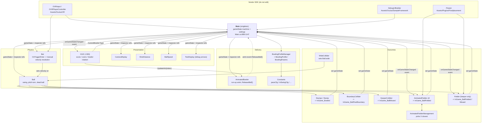
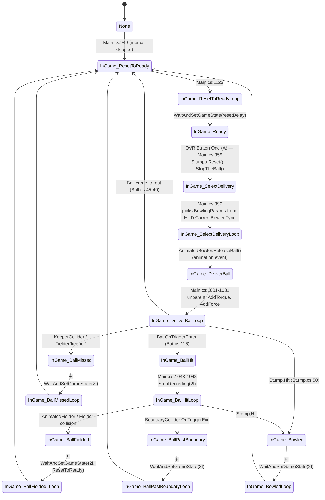

# CricketVR — Technical Design Document

> Audience: a Claude Code session opening this repo with zero prior context.
> Written 2026-09-20 against commit `e8e5bec` ("Updating to Unity version 2022.3.4f1").
> Everything here was verified by reading files; claims that could not be verified are marked **⚠️ unverified**.

---

## 1. TL;DR for a new session

- **What**: A single-player VR cricket *batting* simulator for Meta/Oculus Quest. You stand at the crease, a bowler runs in, you swing a tracked bat. Unity **2022.3.4f1**, Android/Quest build target, **Built-in Render Pipeline** (not URP — verified, see §7).
- **First-party code is exactly 21 C# files**: `Assets/Scripts/*.cs` (18), `Assets/BallSpeed.cs`, `Assets/TestDisplay.cs`, `Assets/Editor/CustomEditorScript.cs`. ~5,462 lines total. Nothing else in `Assets/` is ours.
- **Do NOT edit**: `Assets/Oculus/` (vendored, deprecated Oculus Integration SDK), `Assets/Plugins/Pixelplacement/` (iTween), `Assets/ExampleAssets/`, `Assets/TextMesh Pro/`, `Assets/XR/` (generated XR settings assets).
- **Entry point / orchestrator**: `Assets/Scripts/Main.cs` — a `MonoBehaviour` singleton (`Main.Instance`, `Main.cs:10`) on the scene root GameObject named `Main`. It owns the game state machine in `Update()` (`Main.cs:898-1147`) and virtually every cross-object reference.
- **The one scene that matters**: `Assets/Scenes/CricketVR.unity` — the only scene enabled in Build Settings. `Assets/Scenes/Nets.unity` is a practice-nets variant (same `Main` hierarchy); `Assets/Scenes/Splash.unity` is an empty stub (camera + light only).
- **Everything talks through `Main.Instance`.** There are 6 more ad-hoc singletons (`HUD`, `CameraReplay`, `ShotDistance`, `BallSpeed`, `TestDisplay`, `AnimatedBowler`) and a `Main.onGameStateChanged` C# event. There is no DI, no ScriptableObjects, no asmdefs, no tests.
- **Build/run**: open in Unity 2022.3.4f1 with the Android module, `File > Build Settings > Android > Build`, sideload the APK to a Quest. Play-mode in the Editor works too — `Main.GetButton()` (`Main.cs:1219`) maps Quest buttons to keyboard keys when `Application.isEditor`.
- **Known landmine before you build**: `Assets/Scripts/HUD.cs:3` has a bare `using UnityEditor;` in a runtime script. That normally fails an Android player build. See §10.
- **Read `NOTES` at the repo root first.** It is the owner's TODO list *and* it documents the settings-propagation contract (§5.7) that `Main.cs` actually implements.

---

## 2. Repo layout

```
CricketVR/
├── NOTES                              ★ FIRST-PARTY. Owner's TODO + "Logic Flow" contract (§5.7)
├── Docs/TechnicalDesignDocument.md    ★ this file
├── .gitignore
├── .vsconfig, InitCodeMarker          (tracked, inert)
│
├── Assets/
│   ├── Scripts/                       ★ FIRST-PARTY — all 18 gameplay scripts
│   │   ├── Main.cs                    (1353 L) orchestrator + state machine + settings + debug console
│   │   ├── Ball.cs                    (219 L)  swing, pitch-turn, dead-ball, trail
│   │   ├── Bat.cs                     (342 L)  hand attach + manual bat/ball collision resolution
│   │   ├── HUD.cs                     (420 L)  scoring, overs, batsmen/bowler rotation, scoreboard UI
│   │   ├── Constants.cs               (160 L)  PlayerPrefs keys, bowling configs, enums
│   │   ├── BowlingProfileManager.cs   (268 L)  BowlingParams / BowlingProfile / manager (plain C#)
│   │   ├── AnimatedBowler.cs          (251 L)  bowler run-up animation state driving
│   │   ├── AnimatedFielder.cs         (802 L)  ★LIVE fielding AI
│   │   ├── AnimatedFielderUnchanged.cs(803 L)  ☠DEAD near-clone of the above (see §4.10)
│   │   ├── AnimatedFielderManagement.cs(49 L)  picks the 3 closest fielders to chase
│   │   ├── Fielder.cs                 (185 L)  legacy iTween fielder; LIVE only for the keeper
│   │   ├── Stumps.cs / Stump.cs       (83/59)  wicket reset + "was I knocked?" detection
│   │   ├── BoundaryCollider.cs        (16 L)   four/six trigger
│   │   ├── WideCollider.cs            (45 L)   wide-line colliders that track the batter
│   │   ├── KeeperCollider.cs          (37 L)   ball-passed-the-bat trigger
│   │   ├── ShotDistance.cs            (70 L)   in-world "x.x m" readout
│   │   └── CameraReplay.cs            (167 L)  frame-grab replay onto an in-world screen
│   ├── BallSpeed.cs                   ★ FIRST-PARTY, LOOSE at Assets/ root (§10)
│   ├── TestDisplay.cs                 ★ FIRST-PARTY, LOOSE at Assets/ root (§10)
│   ├── Editor/CustomEditorScript.cs   ★ FIRST-PARTY — 100% commented out, inert
│   ├── Scenes/                        ★ CricketVR.unity (live), Nets.unity, Splash.unity (stub)
│   ├── Resources/                     ★ project art/prefabs/animations (see §6)
│   │   ├── Prefabs/                   Ball, Bat, Stumps, Stadium, Pitch, HUD, Bowler,
│   │   │                              Fielder, "Animated Fielder", David, BowlingMachine, Arrow
│   │   ├── Animations/                Bowling/*.anim (with animation events!), fielder clips,
│   │   │                              "Fielder Controller.controller", Bumrah/Lyon/WalkingModel FBX
│   │   ├── Materials/, Models/, Textures/, UI/
│   │   ├── BillingMode.json           (generated by com.unity.purchasing — unused, §8)
│   │   └── ONSPSettings / OVRBuildConfig / OVRPlatformToolSettings  (Oculus SDK assets)
│   ├── Sounds/                        ★ Crowd, Shot1-3, Stumps (mp3)
│   ├── Oculus/                        ✖ VENDOR — Oculus Integration SDK (deprecated). See §8.
│   ├── Plugins/
│   │   ├── Android/AndroidManifest.xml  ★ FIRST-PARTY (Quest manifest, §7)
│   │   └── Pixelplacement/iTween/       ✖ VENDOR — iTween (USED, see §8)
│   ├── ExampleAssets/                 ✖ VENDOR/sample
│   ├── TextMesh Pro/                  ✖ VENDOR (package-installed essentials)
│   └── XR/                            ✖ GENERATED XR Plugin Management settings assets
│
├── RAW-Assets/                        ★ source art: Bat2.blend, Models/{Fielder,Ground}.blend,
│                                        Textures/{ball-white.png,ground.png,pitch.jpg}, UI/Logo.psd
├── Packages/manifest.json             ★ dependency list (§8)
├── ProjectSettings/                   ★ Unity project config (§7)
├── UserSettings/                      ⚠ TRACKED but machine-local (EditorUserSettings, Search.index)
│
├── Library/  Temp/  obj/  Logs/  .vs/     GENERATED
├── *.csproj  CricketVR.sln                GENERATED
```

### Gitignore vs reality

`.gitignore` (repo root) ignores: `.vs`, `Library`, `obj`, `Temp`, `Logs`, `AndroidBuild`, `RAW-Assets-LARGE-NO-BKP`, and six named `.csproj` files plus `CricketVR.sln`.

**Generated/local files that ARE tracked anyway** (they were committed before `.gitignore` covered them; `.gitignore` does not untrack):

| Tracked path | Why it shouldn't be |
|---|---|
| `Assembly-CSharp-firstpass.csproj` | IDE-generated. Note: this exact filename is **missing** from `.gitignore`, which lists the other six `.csproj` names. |
| `Logs/AssetImportWorker0.log`, `Logs/AssetImportWorker0-prev.log`, `Logs/Packages-Update.log`, `Logs/shadercompiler-AssetImportWorker0.log`, `Logs/shadercompiler-UnityShaderCompiler0.log` | 5 Unity editor logs. `Logs` *is* in `.gitignore` but these were already tracked. |
| `UserSettings/EditorUserSettings.asset`, `UserSettings/Search.index`, `UserSettings/Search.settings` | Per-developer editor state, not ignored at all. |
| `InitCodeMarker` (0 bytes), `.vsconfig` | Harmless, but not project content. |

`git status` at `e8e5bec` is clean.

---

## 3. Runtime architecture

### 3.1 The shape of it

There is one god-object. `Main` (`Assets/Scripts/Main.cs`) is a `MonoBehaviour` on the scene-root GameObject `Main`. It:

1. Holds `public static Main Instance` (`Main.cs:10`), assigned in `Start()` (`Main.cs:250-251`) and defensively re-assigned in `Update()` (`Main.cs:903-906`).
2. Caches every other actor as a serialized inspector reference (`Main.cs:38-70`) and resolves their scripts in `Awake()` (`Main.cs:208-240`).
3. Runs the whole match/ball state machine as a `switch` in `Update()` (`Main.cs:944-1137`).
4. Owns *all* user settings and debug tweakables, their UI wiring, and their PlayerPrefs persistence (`Main.cs:73-190`, `296-893`).
5. Mirrors Unity's log stream into an in-world console (`Main.cs:1229-1278`).

Everything else is a satellite that polls `Main.Instance.gameState` in its own `Update`/`FixedUpdate`/`LateUpdate`, or subscribes to the `Main.onGameStateChanged` event (`Main.cs:19`), which fires from the `gameState` property setter (`Main.cs:13-16`).

### 3.2 How pieces find each other

| Mechanism | Used by |
|---|---|
| **`[SerializeField]` inspector wiring** | `Main` → ball/bat/stumps/keeper/stadium/boundary/controller/lights/materials/texts/HUD parent (`Main.cs:38-70`); `Bat` → hand transforms, tracker, audio clips (`Bat.cs:9-28`); `Stumps` → 3 stump GameObjects; `AnimatedFielder` → `AnimatedFielderManagement`, hand, animator; `CameraReplay` → target material. |
| **`Main.Instance` static** | Everything. `Ball`, `Bat`, `Stump`, `Fielder`, `AnimatedFielder`, `AnimatedBowler`, `HUD`, `ShotDistance`, `BallSpeed`, `BoundaryCollider`, `WideCollider`, `KeeperCollider`, `BowlingProfileManager`. |
| **Other ad-hoc singletons** (same pattern: `public static X Instance` set in `Start()` if null) | `HUD.Instance` (`HUD.cs:57`), `CameraReplay.Instance` (`CameraReplay.cs:7`), `ShotDistance.Instance` (`ShotDistance.cs:8`), `BallSpeed.Instance` (`BallSpeed.cs:8`), `TestDisplay.Instance` (`TestDisplay.cs:8`), `AnimatedBowler.Instance` (`AnimatedBowler.cs:8`). |
| **C# event** | `Main.onGameStateChanged` — subscribed by `HUD.HandleGameState` (`HUD.cs:94`), `Fielder.HandleGameState` (`Fielder.cs:36`), `AnimatedFielder.HandleGameState` (`AnimatedFielder.cs:78`). |
| **Unity animation events** | `Assets/Resources/Animations/Bowling/*.anim` call `AnimatedBowler.ReleaseBall` (Bumrah.anim, Bumrah 1.anim, Lyon.anim, Steyn Cleaned.anim), `ChangeJogRepeat` (Jog.anim), `ChangeRunRepeat` (Run.anim), `CheckDistanceToStart` (Walk.anim). **`ReleaseBall` is what actually starts the delivery** (`AnimatedBowler.cs:173-179`). |
| **`GameObject.Find` / `Resources.Load`** | **None in first-party code** (verified by grep). |
| **String-name matching** | Heavy. `collisionInfo.gameObject.name == "Ball"`, `== "Plane"`, `.Contains("Keeper")`, `.Contains("WideCollider")`, `.Contains("Material.001")`, and `Main.currentFielderName` is a `string` used as the "who has the ball" token. Renaming scene objects breaks gameplay. |
| **Vendor SDK statics** | `OVRInput` (`Bat.cs:279-288`, `Main.cs:1206-1226`), `DebugUIBuilder.instance` (`Main.cs:298-416`, `942`, `1164`, `1171`) — the Oculus sample-framework in-world settings panel. `iTween.MoveTo/MoveUpdate` for fielder locomotion. |

### 3.3 Script execution order

Set per-script in the `.meta` files (all others default to 0):

| Script | Order | Effect |
|---|---|---|
| `Bat` | **-50** | Runs first each frame. |
| `Ball` | **-20** | |
| `Main` | **-10** | `Main.Update()` runs before all default-order scripts, so the state machine advances before satellites poll it. |
| *(everything else)* | 0 | |
| `HUD` | **+300** | Runs last. Matters: `HUD.Reset()` (`HUD.cs:99`) touches `AnimatedBowler.Instance` and `Main.Instance`, both of which must already be assigned. |

Note the ordering hazard: `Main.Instance` is assigned in `Main.Start()`, not `Main.Awake()`. Scripts with a lower order than `Main` (`Bat` at -50, `Ball` at -20) run their `Start()` before `Main.Start()`, but neither touches `Main.Instance` from `Start()`, so it currently holds.

### 3.4 Diagram



---

## 4. Per-script reference

### 4.1 `Assets/Scripts/Main.cs` (1353 L) — orchestrator

**Responsibility**: singleton registry, game state machine, settings/tweakables + their in-world UI + PlayerPrefs, input abstraction, in-world log console.

**Key state**
- `public static Main Instance` — `Main.cs:10`.
- `public eGameState gameState { get; set; }` — `Main.cs:13-16`; the setter fires `onGameStateChanged` (`Main.cs:19`). Backed by `_gameState` (`:17`).
- Resolved script handles: `theBatScript`, `theBallScript`, `theStumpsScript`, `theBallRigidBody`, `theHUD` — `Main.cs:20-29`, resolved in `Awake()` `Main.cs:208-230`.
- `bowlingProfileManager`, `currentBowlingConfig` (`BowlingParams` for *this* delivery), `currentFielderName` (string token for who holds the ball) — `Main.cs:31-36`.
- Inspector "Connections" block — `Main.cs:38-70`. `theStadium` (`:48`) and `theController` (`:52`) are **wired but never read by live code** (`theStadium` only appears in commented-out `AnimatedFielder` code).
- "Settings" block (`Main.cs:73-102`): `difficulty`, `battingStyle`, `stadiumMode`, `zOffset` [3,10], `hudOffset` [3,5], each paired with a `_`-prefixed shadow field and cached `Toggle`/`Slider`/`Text` handles.
- "Debug Tweaks" block (`Main.cs:104-190`): `overlayVisible`, `resetDelay` [0,5], `fielderSpeed` [0.5,2.5], `swingType`, `ampMin`, `ampMax`, `MinX/MaxX/MinY/MaxY/MinZ/MaxZ/MinSwing/MaxSwing/MinPitchTurn/MaxPitchTurn`, `BatAmplifier` (default 75).

**Key methods**
| Method | Line | Notes |
|---|---|---|
| `Awake()` | 208 | Resolves component handles; hooks `Application.logMessageReceived`. |
| `Start()` | 248 | Sets `Instance`, builds the menu, loads PlayerPrefs, forces a first `update*(true)` pass, constructs `BowlingProfileManager`, sets `gameState = None`. |
| `SetupMenus()` | 296 | Builds the whole Oculus `DebugUIBuilder` panel: 3 radio groups, 2 settings sliders, 1 toggle, 12 tweakable sliders. The MinY/MaxY sliders are **commented out** (`:377-386`). |
| `updateDifficulty/BattingStyle/StadiumMode/ZOffset/HUDOffset/Tweakables` | 422/519/574/631/656/683 | The §5.7 propagation contract. |
| `updateBatColliderSize()` | 488 | Scales the bat BoxCollider's **x** by 4/2/1 (Easy/Medium/Hard) from `theBatScript.originalSize`. |
| `reloadTweakables()` | 833 | On `swingType` change, copies the 10 floats out of the matching `Constants.*Cfg` array into the public fields. |
| `Update()` | 898 | See §5.1. Editor-only inspector propagation at `:909-918`. |
| `ToggleUI(bool)` | 1158 | Shows/hides the debug panel; **deactivates the bat while the menu is open** and `PlayerPrefs.Save()`s on close. |
| `StopTheBall()` | 1176 | Kinematic + zero velocity + teleport the ball to the hard-coded machine muzzle `(-8.95, 2.95, 0)` (`:1186`). |
| `WaitAndSetGameState(delay, state)` | 1191 | The universal "wait then transition" coroutine. Contains the only plain `Debug.Log` in the hot path (`:1195`). |
| `GetButton(OVRInput.Button, justDown)` | 1219 | Input abstraction. In-Editor it reads the keyboard instead (`GetKeyCodeForButton`, `:1202`): A→RightShift, B→`/`, X→LeftShift, Y→Z. |
| `HandleLog` / `onConsoleTextChange` | 1229 / 1259 | Colour-coded 100-line ring buffer rendered into `consoleText` (last 17 lines). |
| `GetYVel(startPos, startVelX, length)` | 1291 | The "length" ballistics solve — see §5.3. |
| `GetFinalZ` / `Factorial` | 1323 / 1335 | **Dead**. `Factorial` is also a summation, not a factorial (`return n + Factorial(n-1)`). |

**Quirks**
- `Update()` short-circuits the whole state machine while the debug menu is open (`Main.cs:942`).
- `theHUD.txtVersion.text = 1/Time.deltaTime` (`:1146`) — the "version" HUD field actually shows FPS.
- Pressing Quest **X** (`Button.Three`) at any time force-resets to `InGame_ResetToReady` (`:936-939`).

### 4.2 `Assets/Scripts/Constants.cs` (160 L) — static config + enums

Pure static data, no MonoBehaviour. See §6 for the full contents. Also declares every enum used project-wide: `eBattingStyle`, `eDifficulty`, `eStadiumMode`, `eSwingType`, `eGameState` (`:125-147`), `eFielderState` (`:149-159`).

### 4.3 `Assets/Scripts/Ball.cs` (219 L)

On `Ball.prefab`, scene layer **6 (Ball)**, `Rigidbody` mass 0.2, drag 0.25, angularDrag 0.25, SphereCollider r=0.033, `Ball.physicMaterial` (bounciness 0.35).

- `Start()` `:27` — `maxAngularVelocity = 100`, `fresh/bounced/wide = ...`.
- `FixedUpdate()` `:36` — lazily grabs the `TrailRenderer`; dead-ball detection `:45-49`; enables/disables the trail per state `:52-79`; air-resistance & swing block `:81-125`; kills the ball if it falls below y = -10 `:127-131`.
- `LateUpdate()` `:144` — caches `lastVelocity`, which `Bat` reads as the pre-impact ball velocity.
- `OnCollisionEnter` `:160` — first-bounce detection on tag `"Ground"` and pitch-turn impulse `:167-197`; post-shot bounce flag on object named `"Plane"` `:199-205`.
- `PlayTrail()` / `StopTrail()` `:134-142` — **empty stubs, called by nobody**.
- Physics detail: see §5.3.

### 4.4 `Assets/Scripts/Bat.cs` (342 L)

On `Bat.prefab`. **In the scene the BoxCollider is overridden to `isTrigger = 1`**, layer **8 (Bat)**, size `(0.25, 0.25, 1.2)`, centre z = -0.34. Rigidbody is kinematic, mass 2, `UseGravity = 0`, interpolate on.

- Inspector: `controllerParent`, `leftHandParent`, `rightHandParent`, left/right grab offset position+rotation, `trackerObject`, `audioShot1/2/3`, `fieldersParent` — `:9-28`.
- `Start()` `:59` caches `batCollider` + `originalSize` (used by `Main.updateBatColliderSize`).
- `CheckAndGrab()` / `SetBatIgnoreHandCollision()` `:73-103` — toggles `Physics.IgnoreCollision` between bat colliders and the controller-hand colliders.
- **`OnTriggerEnter()` `:106-268` — the manual bat/ball collision. This is the single most important function in the project.** See §5.2.
- `ProvideVibration()` `:276` — 0.1 s full haptics on the hand holding the bat.
- `Update()` `:292` — `trackerVelocity = trackerPos - trackerPreviousPos` (a per-**frame** delta, *not* per second) and a 5-sample ring buffer `trackerMags`.
- `LateUpdate()` `:307` — hard-snaps the bat transform onto `attachParent` (the chosen hand) plus the per-hand grab offset. No physics joint; the bat is teleported every frame, which is why its `Rigidbody.velocity` is ~0 (relevant to §5.2).
- `AutomaticReset(2f)` `:270` — only fires in the `Nets` scene (`:260-263`).

### 4.5 `Assets/Scripts/HUD.cs` (420 L)

Execution order **+300**. On `HUD.prefab`. Also declares the plain classes `Batsman` (`:6`) and `Bowler` (`:18`).

- `Start()` `:89` — subscribes to `Main.Instance.onGameStateChanged`, then `Reset()`.
- `Reset(totalOvers = 5)` `:99` — seeds an 11-man batting order and an 8-man bowling attack with fixed names and `eSwingType`s (`:110`, `:121-122`), pushes a matching `AFInfo` per bowler into `AnimatedBowler.Instance.myBowlers` (`:127`), sets `Main.Instance.swingType`, positions the keeper, and calls `AnimatedBowler.UpdateInfo`.
- `HandleGameState()` `:146` — the scoring engine. See §5.6.
- `AddRuns(int)` `:220` — `-1` = wicket, `0` = dot, `1/3` = run + strike swap, `2/4/6` = runs, `10` = wide.
- `SelectNextBowler()` `:281`, `UpdateKeeperPosition()` `:294`, `IncrementBalls()` `:337` (over rollover + `Debug.LogWarning("MATCH DONE!!!!")` at `:354`), `IncrementWickets()` `:359` (all-out warning at `:374`).
- `UpdateUI()` `:378` — renders score, run-rate, both batsmen, overs, bowler, and the per-ball ticker with `|` over separators.
- **`using UnityEditor;` at line 3** with its only consumer (`PlayerSettings.bundleVersion`) commented out at `:380`.
- **No end-of-innings handling** — `Debug.LogWarning` only.

### 4.6 `Assets/Scripts/BowlingProfileManager.cs` (268 L)

Three plain (non-MonoBehaviour) classes. Lines `:5-113` are a fully commented-out earlier generation of `BowlingParams`/`BowlingProfile` that used `speedY` instead of `length`.

- `BowlingParams` `:115` — one delivery: `swingType`, `torqueX`, `speedX`, `length`, `speedZ`, `swing`, `pitchTurn`, `applySwing`, `applyPitchTurn`.
- `BowlingProfile` `:149` — min/max ranges (`minX/maxX`, `minLen/maxLen`, `minZ/maxZ`, `minSwing/maxSwing`, `minPitchTurn/maxPitchTurn`) plus `GetRandomDelivery()` `:188`.
- `BowlingProfileManager` `:225` — five profiles built from `Constants.*Cfg` in `InitProfilesFromParams()` `:238`; `GetProfile(eSwingType)` `:248` resolves `Random` by rolling `Random.Range(0,5)`.

### 4.7 `Assets/Scripts/AnimatedBowler.cs` (251 L)

Singleton on `Bowler.prefab`. Also declares `AFInfo` (`:224`) and `AFInfoData` (`:244`).

- `Awake()` `:32` builds `configs` — five `AFInfo` entries **indexed to match `eSwingType` minus 1** (Pace, InSwing, OutSwing, LegSpin, OffSpin); `HUD.Reset()` indexes them with `((int)boTypes[i]) - 1` (`HUD.cs:127`).
- `AFInfo` ctor `:233` back-computes the run-up start from jog/run repeat counts: `startPos.x - ((jogRepeat + runRepeat) * 2.2f)`.
- `LateUpdate()` `:64` drives the Animator by `Main.Instance.gameState`; `StartBowling()` coroutine `:129` parents the ball to the bowler's hand, sets `Jog Repeat`/`Run Repeat`/`Time` animator params (animation speed scales with `currentBowlingConfig.speedX`, `:138`), then waits through Idle→Jog→Run.
- `ReleaseBall()` `:173` — **called from the bowling animation clips**. Sets `gameState = InGame_DeliverBall`, then walks the bowler back.
- `FixedUpdate()` `:113` — 60-frame "glide" lerp back to the mark.

### 4.8 `Assets/Scripts/AnimatedFielder.cs` (802 L) — the live fielding AI

**Live instances**: 9 components added in-scene onto `David.prefab` instances named `AFielder_01`…`AFielder_09`, parented under the active `Main/Fielders` GameObject. (The 9 `Animated Fielder.prefab` instances in the same scene are **deactivated**.)

- `Start()` `:58` — **derives its fielding position from the last character of its own GameObject name**: `Constants.fieldingPositions[int(name.Last()) - 1]` (`:75`). Renaming `AFielder_0N` breaks this (and index 0 / >9 throws).
- `HandleGameState()` `:110` — sets `holdBall` when this fielder's name matches `Main.currentFielderName`.
- `Update()` `:134` — while the `"1 Run"` animation state is active, computes a dynamic `pickUpDistance` and a 30-frame-lookahead ball position, and claims the ball by writing its own name into `Main.currentFielderName` if that string is still empty (`:145-150`).
- `LateUpdate()` `:169` — the per-state behaviour block; on `InGame_BallHit*` it runs `CalculateInterceptTime()` → `RotateTowardsIntercept()` → `RunTowardsAndFieldBall()` (`:233-272`).
- `CalculateInterceptTime()` `:286` — registers `(interceptTime + increment) → this` with `AnimatedFielderManagement`, nudging by -0.01 on key collision (`:295-300`).
- `GetInterceptPoint()` `:663` — the real solver. Closed-form quadratic-in-tan(θ/2) intercept between a constant-velocity ball and a constant-speed fielder (`g = 2.9f / 22f / Time.deltaTime`, `:673`). Each root is computed inside a `try/catch` that swallows into `empty()` (`:797`). If no real root, it falls back to aiming at the boundary along the ball's velocity (`:692-700`, `:727-734`).
- `FieldTheBall()` `:605` — waits for range, plays the `"4 Pick Up"` clip, freezes the ball kinematic, sets `gameState = InGame_BallFielded`.
- **Dead members**: `Testing()` `:352-417` (only called from commented code), `GetInterceptPoint2()` `:740-795` (never called), `public static List<AnimatedFielder> instances` `:55` (never assigned or read), `private float seconds` `:47` (only used in commented code), `empty(object)` `:797`.

### 4.9 `Assets/Scripts/AnimatedFielderManagement.cs` (49 L)

On the active `Main/Fielders` GameObject. `LateUpdate()` `:29-47`: once all 9 fielders have registered an intercept time, sorts and flags the **3 lowest** with `shouldFieldBall = true`, the rest `false`, then clears both collections. `Update()` `:24` is empty.

### 4.10 `Assets/Scripts/AnimatedFielderUnchanged.cs` (803 L) — ☠ DEAD

Byte-identical to `AnimatedFielder.cs` except: the class name (line 8) and line 299, where the `animatedFielderManagementScript.fielders.Add(...)` call is commented out under a `//UNDO` marker. `diff` between the two files is 9 lines. Its GUID (`6c59cb5258b22480a8dae15987aef0c8`) appears in **zero** scenes and **zero** prefabs. It is a backup copy left in the tree.

### 4.11 `Assets/Scripts/Fielder.cs` (185 L) — legacy, partially live

On `Fielder.prefab`. In `CricketVR.unity` there are **10 instances**: `Fielder_01`…`Fielder_09` under `Main/Old Fielders` (**GameObject inactive → dead**) and **`Fielder_Keeper` under the active `Main/Fielders` → LIVE**.

So: `Fielder.cs` is still executing, but only as the wicket-keeper.

- `OnCollisionEnter` `:71` — the keeper branch (`isKeeper`, auto-set from the name at `:40-41`) converts a `DeliverBallLoop` contact into `InGame_BallMissed` and a `BallHitLoop` contact into `InGame_BallFielded`.
- `LateUpdate()` `:115` — iTween-driven movement: return to `StartPosition`, "take start" 2 m forward during the delivery, and `iTween.MoveUpdate` chase after a shot (`:162-184`). The keeper is excluded from the last two by `!isKeeper`.
- Movement speed comes from `Main.Instance.fielderSpeed`.

### 4.12 `Assets/Scripts/Stumps.cs` (83 L) + `Stump.cs` (59 L)

- `Stumps` — inspector refs to `LegStump`/`MiddleStump`/`OffStump`; caches reset transforms + rigidbodies in `Start()` `:24`; `Reset()` `:53` un-kinematics → teleports → re-kinematics each stump. Called from `Main.cs:964`.
  **Bug**: `Stumps.cs:42` and `:49` both call `LegStump.GetComponent<Stump>()` when populating `stumps[1]` and `stumps[2]`. Harmless today only because the `stumps[]` array is never read.
- `Stump` — detects its own displacement (`Vector3.Distance > 0.01f` or `Quaternion.Angle > 0.01f`, `:22`) in `Update()` and calls `Hit()` `:34`, which dampens the ball, plays the stump sound after 0.3 s, and sets `gameState = InGame_Bowled`.
  Consequence: **any** nudge — bat, fielder, a stray physics settle — registers as bowled while the ball is live. (The `NOTES` file lists "Fix wickets collision issues" as open.)

### 4.13 Trigger scripts

| Script | Scene GameObject(s) | Behaviour |
|---|---|---|
| `BoundaryCollider.cs` (16 L) | `BoundaryCollider` (CapsuleCollider, referenced by `Main.theBoundaryCollider`) | `OnTriggerExit` `:5` — ball leaving during `InGame_BallHitLoop` → `resetDelay = 4f` and `gameState = InGame_BallPastBoundary`. The `else` branch at `:12-13` is unreachable (same condition was just checked). |
| `KeeperCollider.cs` (37 L) | `KeeperCollider`, `OffWideCollider`, `LegWideCollider` (3 instances) | `OnTriggerExit` `:7` — ball leaving during `InGame_DeliverBallLoop` → `resetDelay = 2f`; if the object's name contains `"WideCollider"`, sets `Ball.wide = true`; then `InGame_BallMissed`. |
| `WideCollider.cs` (45 L) | `OffWideCollider`, `LegWideCollider` (co-located with `KeeperCollider`) | `Update()` `:19` repositions the wide line on Z relative to the tracked `player` transform, with a floor at ±(size/2 + offset). Magic offsets `-0.12/-0.18/-0.3` (leg) and `0.12/1.08/1.2` (off) at `:23-41`. |

### 4.14 `Assets/Scripts/CameraReplay.cs` (167 L)

Singleton on the `Replay Cam` GameObject. Two "view settings": `0` = the fixed start pose with FOV 7 (`:58-63`), `1` = a fixed point `(-14, 1.78, 0)` looking at the ball with FOV 60 (`:64-70`).

- `StartRecording(delay)` `:73` → `StartCapturing` `:81`: destroys previous frames, then every `captureRate` (7) `FixedUpdate`s does `Graphics.CopyTexture(myCamera.activeTexture, new Texture2D(...ARGB32...))` and appends to a `List<Texture2D>`.
- `StopRecording(delay)` `:108` → `StartDisplaying` `:118`: loops the captured frames onto `targetMat`'s `_MainTex` at `replaySpeed` 1.0, restoring `Texture2D.blackTexture` on exit.
- Driven from `Main` (`StartRecording` at `Main.cs:1029`, `StopRecording` at `:1047/:1078/:1094`) and `Bat.cs:258` (`setViewSetting(1, 1f)`).
- **Unbounded memory**: one `Texture2D` allocation per capture with no frame cap; on Quest this is a real allocation hazard. ⚠️ not profiled.

### 4.15 `Assets/Scripts/ShotDistance.cs` (70 L)

Singleton on `Distance Text` (`TMP_Text`). `FixedUpdate()` `:22` shows the live ground-plane distance between ball and bat during the shot states; resets to `"0.0 m"` when a new delivery is being selected. `calculateDistance()` `:44` is **100% commented out** yet still called from `Bat.cs:241` (with a stray double semicolon).

### 4.16 `Assets/BallSpeed.cs` (50 L) — ⚠ loose at `Assets/` root

Singleton on `Ball Speed Text`. `updateBallSpeed()` `:21` is a coroutine started from `Main.cs:1030`; waits 3 fixed updates then prints `"Release: N kph"` from `|velocity| * 3.6`. `updateBatAndFinalSpeed()` `:37`, called from `Bat.cs:216`, appends `"Bat: ... kph"` / `"Bounce: ... kph"`.
**Unit bug**: the `batSpeed` it is handed is derived from `trackerVelocity`, which is a per-frame displacement (`Bat.cs:294`), not m/s — so the "Bat" reading is frame-rate dependent and not in kph.

### 4.17 `Assets/TestDisplay.cs` (54 L) — ⚠ loose at `Assets/` root

Singleton on `Test Text`. `setText`/`addText` plus `addArrow(from, to, color)` `:38`, which instantiates `arrowPrefab` (`Assets/Resources/Prefabs/Arrow.prefab`), scales it to the vector length and tints it. Used by `Bat.cs:243-255` to visualise `ballBounce`, `batSwing`, bat `up` and tracker velocity when `Main.overlayVisible`. Arrows are destroyed in `Main.cs:984-986`.

### 4.18 `Assets/Editor/CustomEditorScript.cs` (29 L)

Entirely commented out (all 29 lines). It was a `[CustomEditor(typeof(Main))]` inspector that pushed `zOffset` into `DebugUIBuilder`. Inert; safe to ignore or delete.

---

## 5. Key subsystems

### 5.1 Game state machine and ball lifecycle

`eGameState` (`Constants.cs:125-147`) uses a **paired "enter / loop"** convention: the non-`Loop` state runs one-shot logic in `Main.Update()` then immediately advances to its `…Loop` twin, which idles until an external event (a trigger, a collision, a coroutine) changes it.

The switch lives at `Main.cs:944-1137` and **only runs while the Oculus debug menu is hidden** (`Main.cs:942`).



Notes:
- `InMenu` is declared but the state machine jumps straight past it (`Main.cs:946-951`, and the `InMenu` case at `:952-956` is empty). `// TODO: Add these later` sits on `Constants.cs:129`.
- The delivery is *not* started by `Main` — `InGame_SelectDeliveryLoop` deliberately does nothing (`Main.cs:993-999`) and waits for `AnimatedBowler.ReleaseBall()`. The commented line at `Main.cs:998` is the "skip the animation" escape hatch.
- Each terminal outcome hard-codes a 2 s wait (`Main.cs:1066/1082/1098/1113`) *and* the colliders separately overwrite `Main.resetDelay` (0.5 / 2 / 4) — see §6.
- `Main.currentFielderName` is cleared on entering `InGame_Ready` (`Main.cs:961`); the first `AnimatedFielder` to claim it wins the ball.

**What happens on delivery** (`Main.cs:1001-1032`): unparent the ball from the bowler's hand → zero velocity → build `torque = (torqueX, 0, 0)` → compute `myY` via `GetYVel` → `isKinematic = false`, `CollisionDetectionMode.ContinuousDynamic`, `RigidbodyInterpolation.Interpolate` → `AddTorque(torque, Impulse)` → `AddForce(speed, Impulse)` → reset `fresh/bounced/wide/hasHitBall` → start recording + the ball-speed readout.

Because `AddForce(..., Impulse)` divides by mass (0.2), `speedX = 7.8` becomes **39 m/s ≈ 140 kph**. `Constants.cs:57` records the same rule of thumb: "Multiply x y z values by 18 to convert to kmh".

### 5.2 Bat–ball collision (the manual resolution)

Git history: commit `800c3c5` (2024-01-30) — *"Changed bat and ball collision from collider to trigger and calculated it manually"*. The bat's BoxCollider is `isTrigger = 1` in the scene, so Unity contributes **nothing**; `Bat.OnTriggerEnter` (`Bat.cs:106-268`) writes `Ball.Rigidbody.velocity` directly.

Guard (`Bat.cs:109-115`): name must be `"Ball"`, `hasHitBall` must be false, and the state must be `DeliverBallLoop`/`BallHit`/`BallHitLoop`. Otherwise it logs a `CAUTION` (`:266`).

The live math (`Bat.cs:190-216`):

```csharp
Vector3 ballMomentum = ballInitialVelocity;                                        // :191  DEAD — never used
float   contactRadius = 1f;                                                        // :192  TODO: real contact point
Vector3 batMomentum  = rb.velocity + rb.angularVelocity * contactRadius;           // :193  DEAD — never used
                                                                                   //       (and rb is kinematic & teleported,
                                                                                   //        so rb.velocity is ~0 anyway)

float dampenFactor = 1f;                                                           // :197
float angle = 180f - Vector3.Angle(transform.up, ballInitialVelocity);             // :198  bat face vs incoming ball
Vector3 ballBounce = (angle < 45f)                                                 // :199-206
    ? ((-ballInitialVelocity).normalized + transform.up.normalized).normalized * |v| * dampenFactor
    : (( ballInitialVelocity).normalized + transform.up.normalized).normalized * |v| * dampenFactor;

float avgBatSpeed = trackerMags.Average();                                         // :208  mean of last ≤5 per-FRAME deltas
Vector3 batSwing  = transform.up
                  * cos(Vector3.Angle(transform.up, trackerVelocity))              // :211  component of swing along bat face
                  * avgBatSpeed;

ballBounce /= 75f;                                                                 // :212  magic divisor
Vector3 finalVel = ballBounce + batSwing;                                          // :213
finalVel *= Main.Instance.BatAmplifier * contactRadius;                            // :214  BatAmplifier default 75, UI 50..200
ball.velocity = finalVel;                                                          // :215
```

Reading it plainly:
- **Reflection term** — the ball's incoming direction is combined with the bat's face normal (`transform.up`) and normalised, then re-scaled to the incoming speed. The `angle < 45°` branch flips the incoming direction so a square-on hit sends the ball back rather than through.
- **Swing term** — the bat's tracked motion is projected onto its face normal (`cos` of the angle between face and tracker velocity) and scaled by the mean tracker speed over the last 5 frames.
- **Scaling** — the reflection term is divided by 75 and the sum is multiplied by `BatAmplifier` (75 by default), so with default settings the reflection term is effectively `ballBounce * 1.0` and the swing term is `batSwing * 75`. Tuning `BatAmplifier` changes the *relative* weight of bat swing against the reflection.
- **Units are inconsistent**: `ballBounce` is derived from a proper m/s velocity, `batSwing` from a per-frame displacement. `BatAmplifier` is carrying that unit mismatch. Anything that changes frame rate changes shot power.
- `trackerMags` (`Bat.cs:37`) is a serialized `List<float>` filled in `Update()` (`:295-303`); `.Average()` on an empty list would throw, so a hit on the very first frame is theoretically unsafe.

After the velocity is set (`Bat.cs:218-263`): dot product for sound selection → one of `audioShot1/2/3` by `|ballInitialVelocity - trackerVelocity.normalized*avgBatSpeed|` thresholds 25 / 30 (`:223-237`) → haptics (`:240`) → `ShotDistance.calculateDistance` (`:241`, no-op) → debug arrows if the overlay is on (`:243-255`) → `hasHitBall = true` → replay camera to view 1 after 1 s (`:258`).

Line `:259` — `fieldersParent.BroadcastMessage("StartRotateTowardsIntercept")` — is commented out; the animated fielders self-trigger from `LateUpdate` instead.

### 5.3 Ball physics: bounce, length, swing, turn

**Bounce** is plain PhysX, tuned by physic materials in `Assets/Resources/Materials/`:

| Material | dynamic/static friction | bounciness | combine |
|---|---|---|---|
| `Ball.physicMaterial` | 0.1 / 0.1 | **0.35** | friction Average(0), bounce Maximum(3) |
| `Pitch.physicMaterial` | 0.6 / 0.6 | **0.7** | friction Average(0), bounce Maximum(3) |
| `Bat.physicMaterial` | 1.0 / 1.0 | 0.05 | both Maximum(3) |

Because `bounceCombine = Maximum`, the pitch's 0.7 wins on ball↔pitch contacts.

**Length** — `BowlingParams.length` is *where on the pitch the ball should pitch* (an x coordinate), not a speed. `Main.cs:1008` converts to feet (×3.28) and solves for the launch y-velocity:

```csharp
float GetYVel(Vector3 startPos, float startVelX, float length)      // Main.cs:1291
{
    float height   = 0.1f;
    float time     = (length - startPos.x) / startVelX;             // :1295  time-of-flight to the target
    float startVelY = (16f * time) + (height - startPos.y / time);  // :1296  16 ≈ g/2 in ft/s²
    return startVelY;
}
```
The caller then converts back: `speed.y = myY * mass / 3.28f` (`Main.cs:1009`).
⚠️ **Suspected precedence bug**: `height - startPos.y / time` parses as `height - (startPos.y / time)`. The standard projectile form would be `(height - startPos.y) / time`. Not fixed here — documenting only.

Three earlier `GetYVel` variants are commented out at `Main.cs:1149-1156`, `:1280-1288` and `:1345-1352`, all using the `((2·x²·h) − (d²·g)) / (2·d·x)` form.

**Swing (in the air)** — `Ball.FixedUpdate` `:87-124`, applied only while `InGame_DeliverBallLoop` and `currentBowlingConfig.applySwing`:

```csharp
p = 0.25f; cd = 0.25f;  a = π * 0.0575²;                  // :88-90 (0.0575 m ≈ cricket ball radius)
v = |velocity|;  direction = -velocity.normalized;         // :91-92
forceAmount = (p * v * v * cd * a) / 2;                    // :93  drag magnitude

// AddForce(direction * forceAmount) is COMMENTED OUT at :96-97 —
// the drag term exists only to give swing a speed-squared magnitude.

right = Cross(direction, Vector3.up)   for InSwing / LegSpin  (or Random heads)   // :108
right = Cross(-direction, Vector3.up)  for OutSwing / OffSpin (or Random tails)   // :111
forceAmount *= 10f;                                                                // :115
right.x = 0f; right.y = 0f;                                                        // :116-117  ← only Z survives
AddForce(right * forceAmount * currentBowlingConfig.swing, ForceMode.Force);       // :118
```
So lateral swing is a **pure world-Z force** whose magnitude scales with v², the profile's `swing` value, and a fixed ×10. A `Random` swing type re-rolls the direction **every physics tick** (`Ball.cs:105`), so it jitters rather than swinging consistently.

**Pitch turn (off the deck)** — `Ball.OnCollisionEnter` `:167-197`, on the first contact with a collider tagged `"Ground"` while `fresh`:

```csharp
fresh = false;  currentBowlingConfig.applySwing = false;                            // :171-172  swing stops after pitching
if (applyPitchTurn) {
    direction = -velocity.normalized;
    right = Cross(-direction, up)  for InSwing / LegSpin;                           // :184   ← note: opposite sign to air swing
    right = Cross( direction, up)  for OutSwing / OffSpin;                          // :187
    AddForce(right * pitchTurn * |velocity| * 0.1f, ForceMode.Impulse);             // :191
}
```
Unlike the air-swing path, `right` is **not** flattened to Z here, so x/y components are retained. The comment at `:174` — "treat in-swing as leg-spin and out-swing as off-spin" — explains why swing and spin share one code path.

**Dead ball** — if the ball has bounced, is slower than 0.1 m/s and we are still in `InGame_DeliverBallLoop`, `Ball.cs:45-49` sets `resetDelay = 0.5f` and forces `InGame_ResetToReady`.
**Out of world** — below y = -10 the ball is frozen kinematic (`Ball.cs:127-131`).

**Trails** — a `TrailRenderer` (not a ParticleSystem; the old particle code is commented out throughout) is enabled only during the flight/shot states (`Ball.cs:52-79`).

### 5.4 Bowling profiles and parameterisation

```
Constants.paceCfg / inSwingCfg / outSwingCfg / legSpinCfg / offSpinCfg   (Constants.cs:65-69)
        │  float[10] = { minX, maxX, minLen, maxLen, minZ, maxZ, minSwing, maxSwing, minTurn, maxTurn }
        ▼
BowlingProfileManager.InitProfilesFromParams()                           (BowlingProfileManager.cs:238)
        ▼
BowlingProfile (5 of them, one per eSwingType)
        ▼  GetRandomDelivery()                                           (BowlingProfileManager.cs:188)
BowlingParams  →  Main.currentBowlingConfig                              (Main.cs:976)
        ▼
Main.Update / InGame_DeliverBall  →  AddTorque + AddForce                (Main.cs:1001-1032)
Ball.FixedUpdate                  →  swing                               (Ball.cs:99-124)
Ball.OnCollisionEnter             →  pitch turn                          (Ball.cs:176-194)
AnimatedBowler.StartBowling       →  animation "Time" param from speedX  (AnimatedBowler.cs:138)
```

Current live values (`Constants.cs:65-69`), under the comment "Modified values for more realistic speeds":

| Profile | minX | maxX | minLen | maxLen | minZ | maxZ | minSwing | maxSwing | minTurn | maxTurn |
|---|---|---|---|---|---|---|---|---|---|---|
| `paceCfg` | 7.8 | 8.6 | 0 | 9 | -0.4 | 0 | 0 | 0 | 0 | 0 |
| `inSwingCfg` | 6.9 | 7.8 | -2 | 9 | 0.35 | 0.55 | 0.2 | 0.8 | -0.02 | 0.02 |
| `outSwingCfg` | 6.9 | 7.8 | -2 | 9 | -0.65 | -0.6 | 0.2 | 0.8 | -0.02 | 0.02 |
| `legSpinCfg` | 3.8 | 4.7 | 4 | 10 | -0.4 | -0.2 | 0.1 | 0.3 | 0.2 | 0.5 |
| `offSpinCfg` | 3.8 | 4.7 | 4 | 10 | -0.2 | 0 | 0.1 | 0.3 | 0.2 | 0.5 |

Three older generations of these arrays are commented out above (`Constants.cs:43-53`, `:58-62`) plus a "same ball every time" testing block (`:73-77`) that is worth knowing about when debugging.

Per-delivery randomisation (`BowlingProfileManager.cs:188-222`):
- `torqueX = director * 50f`, where `director = -1` for in/out-swing and **`11`** for everything else (`:191`) — a large asymmetry, presumably deliberate for seam presentation. ⚠️ intent unverified.
- `speedX`, `length`, `speedZ`, `swing`, `pitchTurn` — uniform `Random.Range` within the profile.
- `applySwing = Random(0,1) > 0.05f || swingType is In/OutSwing` — i.e. ~95% of the time, always for swing bowlers (`:200`).
- `applyPitchTurn = Random(0,1) > 0.15f || swingType is Leg/OffSpin` — ~85%, always for spinners (`:201`).
- Post-clamps so a big-swinging in-swinger starts wide of off and vice versa (`:210-220`). The equivalent spin clamp is commented out (`:204-208`).

**Which profile is used** is decided by `HUD.CurrentBowler.Type`, read at `Main.cs:976`. `Main.swingType` is a *separate* mirror used only for the debug-tweak sliders and keeper positioning.

### 5.5 Fielding AI and animation — the three variants

| Script | Instances in `CricketVR.unity` | Status |
|---|---|---|
| **`AnimatedFielder.cs`** | 9 components added onto active `David.prefab` instances `AFielder_01..09`, parented to `Main/Fielders` | **LIVE** — the real fielding AI |
| `Fielder.cs` | `Fielder_01..09` under `Main/Old Fielders` (GameObject **inactive**) + `Fielder_Keeper` under `Main/Fielders` (**active**) | **Half-live** — keeper only |
| `AnimatedFielderUnchanged.cs` | none | **DEAD** — backup copy |
| *(prefab only)* `Animated Fielder.prefab` instances `AFielder_01..09` | 9 instances, all `m_IsActive = 0` | **Disabled** — superseded by the David-based ones |

Live pipeline for a shot:

1. `Bat.OnTriggerEnter` sets `InGame_BallHit`.
2. Each `AnimatedFielder.LateUpdate` (`:233-272`) starts `CalculateInterceptTime()` once (`hasRun_CalculateInterceptPoint`).
3. After a 0.2 s delay each fielder solves `GetInterceptPoint()` (`:663`) and registers `(time → this)` with `AnimatedFielderManagement`.
4. `AnimatedFielderManagement.LateUpdate` (`:32-47`) waits for all 9, sorts, and flags the 3 fastest with `shouldFieldBall = true`.
5. Flagged fielders `RotateTowardsIntercept()` then `RunTowardsAndFieldBall()` (Animator `Action` 0 = Idle, 1 = Run, 4 = Pick Up).
6. The first one to get within range writes its name into `Main.currentFielderName` (`:145-150`) and runs `FieldTheBall()` (`:605`), which freezes the ball and sets `InGame_BallFielded`.
7. `HandleGameState` then makes that fielder hold the ball at its hand bone (`holdBallOffset`, `AnimatedFielder.cs:97/173`).

Fielding positions come from `Constants.fieldingPositions` (`Constants.cs:79-88`), 9 hard-coded `Vector3`s, indexed by the last digit of the GameObject name.

Animator states referenced by name: `"0 Idle"`, `"1 Run"`, `"4 Pick Up"` (controller: `Assets/Resources/Animations/Fielder Controller.controller`). The bowler's animator uses `"Idle"`, `"Jog"`, `"Run"` plus int params `Action`, `Jog Repeat`, `Run Repeat` and float `Time`.

### 5.6 Scoring, wickets, boundary/wide/keeper

All of it lives in `HUD.HandleGameState()` (`HUD.cs:146-217`), driven by the `onGameStateChanged` event.

| Trigger state | Logic | Result |
|---|---|---|
| `InGame_BallHit` | `StartOfShot = UtcNow` (`:215`) | starts the run-scoring timer |
| `InGame_BallFielded` | if `!Ball.bounced` → **caught** (`AddRuns(-1)`); else classify by elapsed seconds (`:159-170`) | `<2 s` → 0, `<4.5 s` → 1, `<7.5 s` → 2, `<11 s` → 3, else 4 |
| `InGame_BallPastBoundary` | `!Ball.bounced` → **6**, else **4** (`:191-205`) | |
| `InGame_BallMissed` | `Ball.wide` → `AddRuns(10)` (a wide: +1 run, no ball counted); else dot (`:175-190`) | |
| `InGame_Bowled` | `AddRuns(-1)` (`:206-211`) | wicket |

`AddRuns` (`:220-272`) then routes to `IncrementRuns` / `IncrementWickets` / `IncrementBalls` and appends a token (`"W"`, `"*"`, `"1"`, `"wd"`, …) to `BowledBalls`. Odd runs (1, 3) swap the strike.

`IncrementBalls` (`:337`) rolls the over at 6, swaps the batsmen, and calls `SelectNextBowler()` — which sets `Main.Instance.swingType`, repositions the keeper (`UpdateKeeperPosition`, `:294`, using `Constants.KeeperPosition{Slow,Medium,Fast}`) and tells `AnimatedBowler` which run-up config to use.

There is **no innings-end or all-out handling** beyond two `Debug.LogWarning` calls (`:354`, `:374`).

Note the two colliders shadowing each other: `OffWideCollider` and `LegWideCollider` each carry **both** a `WideCollider` (which moves the line with the batter) and a `KeeperCollider` (which fires the miss + sets `Ball.wide`).

### 5.7 Settings, the HUD panel, and the PlayerPrefs propagation contract

`NOTES` (repo root, bottom) states the contract verbatim:

```
Logic Flow
==========
On Device  - UI Toggle/Slider - onXXX(t/val) - set member var - updateXXX(false) - if diff, update & set player prefs
In Editor  - Inspector        set member var - Main.Update()  - updateXXX(true)  - as above PLUS update UI / save prefs
From code  -                  set member var - Main.Update()  - updateXXX(true)  - as above PLUS update UI / save prefs
```

How `Main.cs` implements it:

1. **Every setting is a triple**: a public/serialized field `x`, a private shadow `_x` holding the last-applied value, and cached UI handles `_xText` / `_xSlider` / `_xToggle`. Example: `resetDelay` / `_resetDelay` / `_resetDelayText` / `_resetDelaySlider` (`Main.cs:109-113`).
2. **On-device path** — the `DebugUIBuilder` callback (`onResetDelay`, `Main.cs:874`) writes the public field and calls `updateXXX()` with `savePrefs = false`. The update method diffs `x != _x`, applies the side effect, writes `PlayerPrefs.Set*`, and does **not** call `PlayerPrefs.Save()`. Saving is deferred to `ToggleUI(false)` (`Main.cs:1170`) when the panel closes.
3. **Editor/code path** — `Main.Update()` calls every `updateXXX(true)` **once per frame** while `Application.isEditor` (`Main.cs:909-918`). The diff makes this cheap; `true` additionally pushes the value back into the UI widgets and calls `PlayerPrefs.Save()` when something changed.
4. **Boot** — `Start()` (`Main.cs:257-286`) reads PlayerPrefs into the public fields, then deliberately sets the shadow fields to `-1000` / `eSwingType.None` so the first `updateXXX(true)` is guaranteed to fire and initialise both the world and the UI.

Consequences worth knowing:
- The propagation only runs automatically **in the Editor**. On-device, a value changed from code (not from the panel) never syncs the widget or persists. Note that `resetDelay` *is* written from code in three places (`Ball.cs:47`, `KeeperCollider.cs:12`, `BoundaryCollider.cs:9`) — on device these silently override the user's setting without updating the slider; in the Editor they also get written back to PlayerPrefs.
- `updateTweakables()` (`:683-831`) also pushes the Min/Max slider values into the **live `BowlingProfile` object** for the currently selected `swingType` (`:754-827`), so tweaking a slider re-tunes that bowler type for the rest of the session (not persisted to `Constants`).
- The MinY/MaxY (length range) sliders are commented out in both `SetupMenus` (`:377-386`) and `updateTweakables` (`:771-784`), so `profile.minLen`/`maxLen` are **never** writable from the UI — length range stays at the `Constants` values.

### 5.8 Replay camera

See §4.14. Flow: `InGame_DeliverBall` → `CameraReplay.StartRecording(0f)` (`Main.cs:1029`) → frames captured every 7 `FixedUpdate`s → on `InGame_BallHit`/`Bowled`/`BallMissed`, `StopRecording(2f / 1f / 0f)` (`Main.cs:1047/1078/1094`) starts playback onto the in-world screen material → `InGame_SelectDelivery` clears the coroutine handles and stops display (`Main.cs:977-980`).
Meanwhile `Bat.cs:258` flips the *live* camera to the "follow the ball" pose 1 s after contact.

---

## 6. Data and configuration

### 6.1 `Constants.cs` in full

**PlayerPrefs keys** (`Constants.cs:7-17`) — these are the exact strings on disk:

| Constant | Key string | Type | Default | Written by |
|---|---|---|---|---|
| `PP_Difficulty` | `"difficulty"` | int (`eDifficulty`) | 1 (Easy) | `Main.updateDifficulty` :427 |
| `PP_BattingStyle` | `"style"` | int (`eBattingStyle`) | 1 (RightHanded) | `Main.updateBattingStyle` :527/:534 |
| `PP_StadiumMode` | `"mode"` | int (`eStadiumMode`) | 1 (Night) | `Main.updateStadiumMode` :583/:591 |
| `PP_ZOffset` | `"menu_offset"` | float | 3 | `Main.updateZOffset` :642 |
| `PP_HudOffset` | `"hud_offset"` | float | 4 | `Main.updateHUDOffset` :669 |
| `PP_Overlay` | `"overlay"` | int (0/1) | 1 | `Main.updateTweakables` :739 |
| `PP_ResetDelay` | `"reset_delay"` | float | 2 | `Main.updateTweakables` :712 |
| `PP_FielderSpeed` | `"fielder_speed"` | float | 1.5 | `Main.updateTweakables` :723 |
| `PP_AmpMin` | `"amp_min"` | float | 10 | `Main.updateTweakables` :690 |
| `PP_AmpMax` | `"amp_max"` | float | 15 | `Main.updateTweakables` :701 |

The `CT_*` constants (`Constants.cs:19-29`) are **UI label strings**, not prefs keys: `"minX"`, `"maxX"`, `"minY"`, `"maxY"`, `"minZ"`, `"maxZ"`, `"minSwing"`, `"maxSwing"`, `"minTurn"`, `"maxTurn"`, `"batAmplifier"`. The bowling tweakables are **not persisted**.

**Other constants**
- `BatColliderMultiplierEasy/Medium/Hard = 4 / 2 / 1` (`:31-33`) — multiplies the bat collider's **x** extent.
- `KeeperPositionSlow / Medium / Fast = (11.6,0,0) / (16,0,0) / (20,0,0)` (`:35-37`).
- `CT_SwingPrefixes = { "none", "pace", "inSwing", "outSwing", "legSpin", "offSpin", "random" }` (`:39`) — indexed by `(int)eSwingType`, shown as the bowler style on the HUD (`HUD.cs:418`).
- `fieldingPositions` — 9 `Vector3`s (`:79-88`).
- The five bowling config arrays (`:65-69`) — see §5.4.

### 6.2 Serialized inspector data — `Main` in `CricketVR.unity`

Values currently saved on the `Main` component (they are overwritten from PlayerPrefs at boot, but they are what a fresh install sees in the inspector):

```
difficulty: 1 (Easy)    battingStyle: 1 (RightHanded)   stadiumMode: 1 (Night)
zOffset: 3              hudOffset: 5                    overlayVisible: 1
resetDelay: 2           fielderSpeed: 1.5               swingType: 0 (None)
ampMin: 10              ampMax: 15                      BatAmplifier: 75
MinX: 6   MaxX: 8   MinY: -2   MaxY: -0.5   MinZ: -0.05  MaxZ: 0.25
MinSwing: 0  MaxSwing: 0  MinPitchTurn: 0  MaxPitchTurn: 0
```

### 6.3 ScriptableObjects

**None authored by this project.** The only `.asset` MonoBehaviours are vendor/generated: `Assets/Oculus/OculusProjectConfig.asset`, `Assets/Resources/{ONSPSettings, OVRBuildConfig, OVRPlatformToolSettings}.asset`, `Assets/XR/**`.

### 6.4 Magic numbers that arguably want to be config

| Value | Where | What it is |
|---|---|---|
| `(-8.95f, 2.95f, 0f)` | `Main.cs:1186` | ball reset position inside the bowling machine |
| `75f` divisor + `BatAmplifier` | `Bat.cs:212/214` | bat/ball energy scaling |
| `contactRadius = 1f` | `Bat.cs:192` | placeholder for the real contact offset |
| `25f` / `30f` | `Bat.cs:223/228` | shot-sound thresholds |
| `2f`, `4f`, `0.5f`, `2f` | `Main.cs:1066/1082/1098/1113`, `BoundaryCollider.cs:9`, `Ball.cs:47`, `KeeperCollider.cs:12` | reset delays, split across four files |
| `2f / 4.5f / 7.5f / 11f` | `HUD.cs:162-169` | seconds→runs thresholds |
| `p=0.25, cd=0.25, r=0.0575, ×10` | `Ball.cs:88-90/115` | drag/swing coefficients |
| `0.1f` factor | `Ball.cs:191` | pitch-turn impulse scale |
| `height = 0.1f`, `16f`, `3.28f` | `Main.cs:1008/1294/1296` | length solve constants (feet) |
| `2.9f/22f`, `2.75f/22f`, `30f` lookahead | `AnimatedFielder.cs:673/363/141-143` | fielder speed + prediction horizon |
| `-0.12/-0.18/-0.3`, `0.12/1.08/1.2` | `WideCollider.cs:23-41` | wide-line offsets |
| `captureRate = 7`, `replaySpeed = 1f`, FOV 7/60, `(-14,1.78,0)` | `CameraReplay.cs:52-53/62/66/69` | replay tuning |
| `2.2f`, `60f` glide frames, `0.5f*speedX+1.5f` | `AnimatedBowler.cs:235/118/138` | run-up geometry & anim speed |
| batsman/bowler name lists | `HUD.cs:110/121-122` | hard-coded squads |

---

## 7. Unity project configuration

| Setting | Value | Source |
|---|---|---|
| Editor version | **2022.3.4f1** (rev `35713cd46cd7`) | `ProjectSettings/ProjectVersion.txt` |
| Product / Company | `CricketVR` / `RaoVadapalli` | `ProjectSettings.asset:15-16` |
| Android package | `com.RaoVadapalli.CricketVR` | `ProjectSettings.asset:163` |
| Bundle version | `0.20.4.1`, versionCode 1 | `ProjectSettings.asset:140`, `:169` |
| Android min SDK | **24** | `ProjectSettings.asset:170` |
| Android target SDK | `0` = **Automatic (highest installed)** | `ProjectSettings.asset:171` |
| Android architectures | `2` = **ARM64 only** | `ProjectSettings.asset:252` |
| Scripting backend (Android) | `1` = **IL2CPP** | `ProjectSettings.asset:724-725` |
| API compatibility | `6` = **.NET Standard** | `ProjectSettings.asset:812` |
| Strip engine code | on | `ProjectSettings.asset:174` |
| Android graphics API | `0b` = **OpenGL ES 3** (manual, not auto) | `ProjectSettings.asset:443-446` |
| Colour space | `1` = **Linear** | `ProjectSettings.asset:53` |
| Multithreaded rendering (Android) | on | `ProjectSettings.asset` `mobileMTRendering` |
| **Render pipeline** | **Built-in.** `GraphicsSettings.m_CustomRenderPipeline: {fileID: 0}` and every quality level's `customRenderPipeline` is `{fileID: 0}`. `ProjectSettings/URPProjectSettings.asset` exists but references **no pipeline asset** — it is an empty artefact, and `com.unity.render-pipelines.universal` is **not** in `manifest.json`. | `GraphicsSettings.asset:45`, `QualitySettings.asset:43…` |

### XR

- `com.unity.xr.management` 4.3.3 + `com.unity.xr.oculus` **4.0.0** (`Packages/manifest.json`).
- `Assets/XR/XRGeneralSettings.asset`: the **Android** provider list contains exactly one loader — the Oculus Loader (`Assets/XR/Loaders/Oculus Loader.asset`). Standalone, iPhone and Lumin provider lists are empty. A `Windows MR Loader.asset` + settings exist but are not in any active list.
- `Assets/XR/Settings/Oculus Settings.asset`: `m_StereoRenderingModeAndroid: 2` (**Multiview**), desktop `1`, `SharedDepthBuffer: 1`, `DashSupport: 1`, `V2Signing: 1`.
- Legacy VR (`m_BuildTargetVRSettings`) is present for Standalone with `m_Enabled: 0` — not used.
- `Assets/Oculus/OculusProjectConfig.asset`: `targetDeviceTypes: 0100000002000000` (two device entries), `handTrackingSupport: 0`, `disableBackups: 1`, `skipUnneededShaders: 1`.
- `Assets/Plugins/Android/AndroidManifest.xml`: Quest-style manifest — `com.oculus.vr.focusaware=true`, `com.samsung.android.vr.application.mode=vr_only`, `com.oculus.supportedDevices=quest|quest2`, `uses-feature android.hardware.vr.headtracking required=true`.

### Physics (gameplay depends on these)

| Setting | Value | Source |
|---|---|---|
| `Fixed Timestep` | **0.007 s** (≈143 Hz) — deliberately high for fast-ball collision fidelity | `TimeManager.asset` |
| Max allowed timestep | 0.3333 | `TimeManager.asset` |
| Gravity | `(0, -9.81, 0)` | `DynamicsManager.asset` |
| Default contact offset | **0.001** (10× tighter than Unity's 0.01 default) | `DynamicsManager.asset` |
| Solver iterations / velocity | 6 / 1 | `DynamicsManager.asset` |
| Bounce threshold | 2 | `DynamicsManager.asset` |
| `Queries Hit Triggers` | **1 (on)** | `DynamicsManager.asset` |
| `Auto Sync Transforms` | **0 (off)** | `DynamicsManager.asset` |
| `Reuse Collision Callbacks` | 1 | `DynamicsManager.asset` |
| `Enable Enhanced Determinism` | **1 (on)** | `DynamicsManager.asset` |
| Default max angular speed | 100 | `DynamicsManager.asset` |

**Layer collision matrix** — decoded from `m_LayerCollisionMatrix`, only two pairs are disabled and both are symmetric:

| Disabled pair | Why (inferred) |
|---|---|
| **Body (3) ↔ Ball (6)** | the ball must pass through the player's body collider instead of bouncing off the headset/hands |
| **Stumps (7) ↔ Bat (8)** | you can swing through the stumps without knocking them over |

### Tags and layers (`ProjectSettings/TagManager.asset`)

- **Custom tags** (exactly one): `Ground` — checked at `Ball.cs:167` for first-bounce detection.
- **Layers**: 0 Default, 1 TransparentFX, 2 Ignore Raycast, 3 **Body**, 4 Water, 5 UI, 6 **Ball**, 7 **Stumps**, 8 **Bat**, 9 **Stadium**. Layers 10-31 unused.
- Scene assignments verified: `Ball` → layer 6, `Bat` → layer 8, `Fielders` container → layer 9.
- Sorting layers: `Default`, `UI`.

### Quality (`ProjectSettings/QualitySettings.asset`)

Six stock levels (Very Low → Ultra). `m_CurrentQuality: 2` (Medium) in the editor, but **`m_PerPlatformDefaultQuality.Android: 5`** — the Quest build boots at **Ultra** (pixelLightCount 1, shadows 2/hard+soft, shadowDistance 150, antiAliasing 4×, vSyncCount 0). ⚠️ That is an aggressive default for a Quest; not profiled here.

### Build scenes (`ProjectSettings/EditorBuildSettings.asset`)

13 entries; exactly **one enabled**: `Assets/Scenes/CricketVR.unity`. Disabled: `Splash.unity`, `Nets.unity`, and 10 `Assets/Oculus/SampleFramework/Usage/*.unity` sample scenes.

---

## 8. Dependencies

### 8.1 `Packages/manifest.json` — non-module packages

| Package | Version | Used by first-party code? |
|---|---|---|
| `com.unity.xr.oculus` | 4.0.0 | ✅ the XR runtime (Oculus Loader) |
| `com.unity.xr.management` | 4.3.3 | ✅ XR loader lifecycle |
| `com.unity.xr.legacyinputhelpers` | 2.1.10 | ⚠️ no direct first-party reference; `XRPackageSettings.asset` contains `RemoveLegacyInputHelpersForReload`, suggesting removal was already contemplated. **Unverified** whether the vendored Oculus SDK still needs it. |
| `com.unity.textmeshpro` | 3.0.6 | ✅ `HUD.cs` (`TMPro.TextMeshProUGUI`), `ShotDistance.cs`, `BallSpeed.cs`, `TestDisplay.cs` (`TMP_Text`) |
| `com.unity.ugui` | 1.0.0 | ✅ `Main.cs` uses `UnityEngine.UI.Text`, `Toggle`, `Slider` |
| `com.unity.ide.visualstudio` / `ide.rider` / `ide.vscode` | 2.0.18 / 3.0.24 / 1.2.5 | editor tooling only |
| `com.unity.collab-proxy` | 2.0.5 | Unity VCS plugin; project uses plain git |
| `com.unity.test-framework` | 1.1.33 | ⚠️ **no tests exist** (no test asmdef, no Tests folder) |
| `com.unity.2d.sprite` | 1.0.0 | ⚠️ **no first-party usage found** (2D sprite editor tooling) |
| `com.unity.2d.tilemap` | 1.0.0 | ❌ **UNUSED** — grep for `Tilemap` across `Assets/Scripts`, `Assets/*.cs`, both scenes and all prefabs: zero hits |
| `com.unity.ads` | 4.4.2 | ❌ **UNUSED** — zero hits for `Advertisement` |
| `com.unity.analytics` | 3.8.1 | ❌ **UNUSED** — zero hits for `Analytics` |
| `com.unity.purchasing` | 4.9.3 | ❌ **UNUSED** — zero hits for `UnityEngine.Purchasing`. It has left `Assets/Resources/BillingMode.json` behind. |
| `com.unity.learn.iet-framework` | 3.1.3 | ❌ **UNUSED** — the in-editor tutorial framework that ships with Unity Learn templates; zero hits for `IET` / `Tutorial` in first-party code |
| `com.unity.ai.navigation` | 1.1.4 | ❌ **UNUSED** — zero hits for `NavMeshAgent` / `NavMeshSurface` / `UnityEngine.AI`. Fielder movement is iTween + manual math, not NavMesh. |
| `com.unity.timeline` | 1.7.4 | ❌ **UNUSED** — zero hits for `PlayableDirector`; animation is driven by `Animator` + animation events |

(Verification method: `grep -rl` for the characteristic type name across `Assets/Scripts`, `Assets/*.cs`, `Assets/Scenes/*.unity` and `Assets/Resources/Prefabs/*.prefab`.)

The remaining ~30 `com.unity.modules.*` entries are built-in engine modules. Several are clearly inert for this project (`physics2d`, `tilemap`, `terrain`, `terrainphysics`, `vehicles`, `cloth`, `wind`, `umbra`, `director`, `unityanalytics`, the five `unitywebrequest*` ones) but engine modules are cheap and stripping is on; they are listed here for completeness, not as findings.

### 8.2 `Assets/Oculus` — the vendored Oculus Integration SDK

**Yes, this is a vendored copy of the deprecated Oculus Integration SDK** (the asset-store package, superseded by the Meta XR SDK packages). Evidence:

- Directory layout matches the Integration package exactly: `VR/`, `Platform/`, `Avatar/`, `LipSync/`, `Spatializer/`, `AudioManager/`, `SampleFramework/`, plus `OculusProjectConfig.asset`.
- It ships its own assembly definitions: `Oculus.VR.asmdef`, `Oculus.Platform.asmdef`, `Oculus.VR.Editor.asmdef`, `Oculus.Platform.Editor.asmdef`, `Oculus.VR.Scripts.Editor.asmdef` — these are the only asmdefs in the project.
- `Assets/Oculus/VR/Editor/OVRPluginUpdater.cs` is present (the Integration-only plugin updater).

**Version**: `Assets/Oculus/VR/Scripts/OVRPlugin.cs:46` — `wrapperVersion = OVRP_1_55_0.version`, and `OVRP_1_55_0` (line 6076) is the **highest** `OVRP_1_xx_0` class in the file. So the vendored **OVRPlugin wrapper version is 1.55.0**. There is no `version.txt` or equivalent in the tree.
⚠️ **Unverified**: the corresponding Oculus Integration release number. OVRPlugin 1.55 corresponds to an Integration release from roughly early-to-mid 2021, but I could not confirm the exact `vNN` from anything in this repo. Treat "OVRPlugin 1.55.0" as the authoritative fact and look the release number up externally if it matters.

**What first-party code actually uses from it** (grep-verified, `Assets/Scripts` + `Assets/*.cs`):

| API | Callers |
|---|---|
| `OVRInput.SetControllerVibration` | `Bat.cs:279, 281, 286, 288` |
| `OVRInput.Button`, `OVRInput.GetDown`, `OVRInput.Get` | `Main.cs:1141, 1202-1226` |
| `DebugUIBuilder.instance` (`Assets/Oculus/SampleFramework/Core/DebugUI/Scripts/DebugUIBuilder.cs`) | `Main.cs:298-416`, `:942`, `:1164`, `:1171` — the entire settings panel |
| `OVRPlayerController` (type only, on a serialized field) | `Main.cs:52` — **the field is never read**; the type reference alone keeps the dependency |

That is the **whole** first-party surface: `OVRInput`, `DebugUIBuilder`, and one unused `OVRPlayerController` field. `OVRManager`/`OVRCameraRig` are never referenced from our code (they exist in the scene as prefab components). This is a small, well-bounded migration surface.

### 8.3 `Assets/Plugins/Pixelplacement/iTween` — **used**

`iTween.cs` (single-file tweening library). First-party call sites (grep-verified, non-commented):

- `Fielder.cs:140` `iTween.MoveTo` (return to start)
- `Fielder.cs:158` `iTween.MoveTo` (take start)
- `Fielder.cs:182` `iTween.MoveUpdate` (chase the ball)
- `AnimatedFielder.cs:229` `iTween.MoveTo` (take start)

(`AnimatedFielder.cs:209` and the whole of `AnimatedFielderUnchanged.cs` are commented out / dead.)
It also ships a `Sample/` folder (`MoveSample.cs`, `RotateSample.cs`, `SampleInfo.cs`, `Sample.unity`) that nothing references.

### 8.4 `Assets/ExampleAssets`, `Assets/TextMesh Pro`, `Assets/XR`

`ExampleAssets` is Unity template sample content (`Materials/`, `Models/`, `Prefabs/`, `Textures/`, `Tutorial/`) — no first-party references found. `TextMesh Pro` is the package's imported essentials. `Assets/XR` holds XR Plugin Management's generated settings assets (§7).

---

## 9. Build and run

### Prerequisites
- **Unity 2022.3.4f1** exactly (matching `ProjectVersion.txt`; another 2022.3.x patch will trigger an upgrade-and-reimport).
- Unity Hub module: **Android Build Support**, including **OpenJDK** and **Android SDK & NDK Tools** (IL2CPP for ARM64 needs the NDK).
- A Quest/Quest 2 in developer mode, `adb` available, USB cable or Quest Link.
- No extra OVR build tooling is required for a plain APK. `Assets/Resources/OVRPlatformToolSettings.asset` exists for the Oculus Platform upload tool, but the project does not depend on it for local sideloading.

### Open
1. Open the folder in Unity Hub. First import is slow (the vendored Oculus SDK + ~1 MB scenes).
2. Open `Assets/Scenes/CricketVR.unity`.

### Editor play-mode (no headset)
`Main.GetButton` falls back to the keyboard when `Application.isEditor` (`Main.cs:1202-1227`):

| Quest button | Keyboard | Effect |
|---|---|---|
| A (`Button.One`) | **Right Shift** | start the delivery from `InGame_Ready` |
| B (`Button.Two`) | **`/`** | toggle the settings/tweakables panel |
| X (`Button.Three`) | **Left Shift** | force reset to ready |
| Y (`Button.Four`) | **Z** | mapped but unused |

Remember the state machine is frozen while the panel is open (`Main.cs:942`).

### Build for Quest
1. `File > Build Settings…` → platform **Android** → `Switch Platform` if needed.
2. Confirm only `Assets/Scenes/CricketVR.unity` is ticked.
3. `Edit > Project Settings > XR Plug-in Management > Android` → **Oculus** provider checked (already saved in `Assets/XR/XRGeneralSettings.asset`).
4. `Build` (or `Build And Run` with the headset attached).
5. Sideload manually if needed: `adb install -r <output>.apk`.

Note: `.gitignore` reserves a directory named `AndroidBuild` — that is the owner's conventional output location.

### Things that will bite you
- `Assets/Scripts/HUD.cs:3` `using UnityEditor;` — see §10. This is the first thing to check if the player build fails to compile.
- Android target SDK is **Automatic**; a very new SDK in your install could change behaviour vs. the owner's historical builds.
- The vendored Oculus SDK is from the OVRPlugin-1.55 era; Unity 2022.3 may emit deprecation warnings or `OVRPluginUpdater` prompts on first open.

---

## 10. Code health observations (descriptive inventory — no recommendations)

### Debug logging
**7 active `Debug.*` calls** in first-party code (every other one is inside a comment):

| File:line | Call |
|---|---|
| `Main.cs:1195` | `Debug.Log("Setting GameState from: … to: …")` — fires on **every** state transition |
| `Bat.cs:266` | `Debug.Log("CAUTION: … collided with ball, but game state was …")` |
| `Fielder.cs:78` | `Debug.LogWarning("CAUTION: … collided with ball, but game state was …")` |
| `HUD.cs:354` | `Debug.LogWarning("MATCH DONE!!!!")` |
| `HUD.cs:374` | `Debug.LogWarning("GAME OVER!! ALL OUT")` |
| `KeeperCollider.cs:24` | `Debug.LogError("GAMESTATE ERROR!! …")` — in an unreachable `else` |
| `BoundaryCollider.cs:13` | `Debug.LogError("GAMESTATE ERROR!! …")` — in an unreachable `else` |

Zero `print()` calls outside comments. Note that **all** of these are additionally captured and rendered into the in-world console by `Main.HandleLog` (`Main.cs:1229`), so log volume has a runtime cost.

### Commented-out code

**~985 comment-prefixed lines across 21 files (~18% of all first-party lines).** Per file:

| File | Total | `//` lines | File | Total | `//` lines |
|---|---:|---:|---|---:|---:|
| `Main.cs` | 1353 | **195** | `Ball.cs` | 219 | 47 |
| `AnimatedFielderUnchanged.cs` | 803 | **165** | `Constants.cs` | 160 | 25 |
| `AnimatedFielder.cs` | 802 | **163** | `HUD.cs` | 420 | 25 |
| `BowlingProfileManager.cs` | 268 | **107** | `ShotDistance.cs` | 70 | 20 |
| `Bat.cs` | 342 | **72** | `Fielder.cs` | 185 | 13 |
| `CustomEditorScript.cs` | 29 | **22 (100%)** | `AnimatedBowler.cs` | 251 | 9 |
| `Stumps.cs` | 83 | 7 | `AnimatedFielderManagement.cs` | 49 | 4 |
| `CameraReplay.cs` | 167 | 3 | `Stump.cs`, `WideCollider.cs`, `BallSpeed.cs`, `TestDisplay.cs` | — | 2 each |
| `BoundaryCollider.cs`, `KeeperCollider.cs` | 16, 37 | 0 | | | |

Largest single blocks: `Bat.cs:121-187` (the entire previous collision model), `BowlingProfileManager.cs:5-113` (the previous `BowlingParams`/`BowlingProfile`), `AnimatedFielder.cs:302-350` + `:426-469` + `:528-561` (three earlier intercept algorithms), `ShotDistance.cs:46-63` (the whole body of `calculateDistance`), `Constants.cs:43-53/58-62/73-77` (four generations of bowling configs).

### Duplicated / dead code

- **`AnimatedFielderUnchanged.cs` (803 L)** — near-identical clone of `AnimatedFielder.cs`; `diff` is 9 lines (class name + line 299 commented under `//UNDO`). Referenced by **no scene and no prefab**.
- **`Fielder.cs`** — live only for `Fielder_Keeper`; the nine `Fielder_01..09` instances sit under the inactive `Main/Old Fielders` GameObject.
- **Nine `Animated Fielder.prefab` instances** in `CricketVR.unity` with `m_IsActive: 0`, superseded by `David.prefab` instances carrying an in-scene `AnimatedFielder` component.
- Unused methods: `AnimatedFielder.Testing()` (`:352-417`), `AnimatedFielder.GetInterceptPoint2()` (`:740-795`), `Main.GetFinalZ()` (`:1323`), `Main.Factorial()` (`:1335`, and it computes a *sum*, not a factorial), `Ball.PlayTrail()`/`StopTrail()` (`:134-142`, empty), `AnimatedFielderManagement.Update()` (`:24`, empty), `Fielder.SetState`/`AnimatedFielder.SetState` (invoked only by iTween's `"oncomplete"` string).
- Unused fields: `AnimatedFielder.instances` (`:55`, never assigned), `AnimatedFielder.seconds` (`:47`), `Bat.ballMomentum`/`batMomentum` locals (`Bat.cs:191/193`, computed then discarded), `Main.theStadium` (`:48`), `Main.theController` (`:52`), `Main.ampMin`/`ampMax` (`:126/:132` — persisted to PlayerPrefs and exposed as sliders, but read **only** by commented-out code in `Bat.cs:134/142`), `Main.MinY`/`MaxY` (assigned by `reloadTweakables` but their UI and their write-back to `profile.minLen/maxLen` are both commented out), `Ball.firstImpact` (`:24`, written nowhere), `Bat.startingPosition`/`startingRotation` (`:46-47`, written in `Start` and never read), `Stumps.stumps[]` (never read).
- `ShotDistance.calculateDistance()` is still called from `Bat.cs:241` (with a duplicated `;`) but has an empty body.
- Dead branches: `BoundaryCollider.cs:12-13` and `KeeperCollider.cs:23-24` — `else` clauses whose condition was already asserted in the enclosing `if`.
- `Assets/Editor/CustomEditorScript.cs` — 29 lines, all commented.

### Loose scripts at `Assets/` root
`Assets/BallSpeed.cs` and `Assets/TestDisplay.cs` sit outside `Assets/Scripts/` (both are live singletons used by `Main.cs` and `Bat.cs`). `Assets/Editor/CustomEditorScript.cs` is correctly placed but inert.

### TODO / marker comments
**18 markers**, all `TODO` (no `FIXME`/`HACK`):
`Constants.cs:129`; `Main.cs:425, 987, 995, 1045, 1061, 1076, 1092, 1108`; `Bat.cs:163, 172, 192`; `AnimatedFielder.cs:328, 446`; `AnimatedFielderUnchanged.cs:329, 447`.
Plus two `// QWERTYUIOP` debug-override markers at `HUD.cs:130` and `HUD.cs:288` (both currently commented out — they force `CurrentBowler = Bowlers[2]`).

### Assembly definitions and tests
- **Zero first-party asmdefs.** All 21 first-party scripts compile into the default `Assembly-CSharp` (and `Assembly-CSharp-Editor` for the Editor folder). The only asmdefs in the project belong to the vendored Oculus SDK.
- **Zero tests.** No `Tests` folder, no test asmdef, no `NUnit`/`UnityTest` usage — despite `com.unity.test-framework` 1.1.33 being installed and `playModeTestRunnerEnabled: 0` in `ProjectSettings.asset`.

### Likely build blocker
`Assets/Scripts/HUD.cs:3` — `using UnityEditor;` in a runtime `MonoBehaviour`, outside any `#if UNITY_EDITOR` guard. Its only consumer (`PlayerSettings.bundleVersion`, `HUD.cs:380`) is commented out. In a normal Unity setup this fails player compilation with *"The type or namespace name 'UnityEditor' could not be found"*. ⚠️ **Unverified** — no build was run as part of writing this document.

### Naming inconsistencies
- Method casing is mixed: `updateDifficulty`, `updateTweakables`, `onRadioEasy`, `onZChange`, `setText`, `addArrow`, `calculateDistance`, `updateBallSpeed` (camelCase) vs `Reset`, `UpdateUI`, `AddRuns`, `StartRecording`, `SetState`, `GetInterceptPoint` (PascalCase).
- Field casing is mixed: public `MinX`/`MaxSwing`/`BatAmplifier` (PascalCase) sit next to public `zOffset`/`resetDelay`/`fielderSpeed`/`ampMin` (camelCase).
- The `_`-prefixed shadow convention (`_MinX`, `_resetDelay`) is used both for "last applied value" state **and** for cached UI widget handles (`_MinXText`, `_MinXSlider`) — same prefix, two different meanings.
- `AFInfo` / `AFInfoData` are declared in `AnimatedBowler.cs` although "AF" reads as *AnimatedFielder*; they describe **bowler** run-up configs.
- Enum prefix `e` (`eGameState`, `eSwingType`) is consistent; the `PP_` / `CT_` constant prefixes are consistent.

### Other factual notes
- `Stumps.cs:42` and `:49` assign `stumps[1]`/`stumps[2]` from `LegStump.GetComponent<Stump>()` instead of `MiddleStump`/`OffStump`. Currently harmless because `stumps[]` is never read.
- `Main.cs:1296` — `height - startPos.y / time`; see §5.3.
- `Main.cs:1146` writes FPS into `theHUD.txtVersion`.
- `Bat.trackerMags` is a serialized `List<float>` with no explicit initialisation; `.Average()` at `Bat.cs:208` would throw if it were empty at contact time.
- `Main.Instance` is assigned in `Start()`, not `Awake()` — see §3.3.
- `resetDelay` is both a user setting and a runtime scratch variable written by three collider scripts.
- `AnimatedFielder` derives its identity from the last character of its GameObject name (`:75`), so the `AFielder_0N` naming is load-bearing.
- `CameraReplay` allocates one `Texture2D` per captured frame into an unbounded `List<Texture2D>`.
- `Assets/Scenes/Splash.unity` contains only a `Main Camera` and a `Directional Light`.

---

## 11. Glossary — cricket terms → identifiers

| Term | Meaning | Where it lives in the code |
|---|---|---|
| **Over** | A set of 6 legal deliveries by one bowler | `HUD.Overs`, `HUD.Balls`, `HUD.TotalOvers` (default 5, `HUD.cs:99`); rollover at `HUD.cs:340-356` |
| **Ball / delivery** | One throw at the batter | `BowlingParams` (`BowlingProfileManager.cs:115`); the `InGame_DeliverBall*` states |
| **Wicket** | (a) the three stumps; (b) a batter being dismissed | (a) `Stumps.cs` / `Stump.cs`, layer 7 `Stumps`; (b) `HUD.Wickets`, `AddRuns(-1)` (`HUD.cs:225`) |
| **Stumps** | The three vertical posts | `Stumps.LegStump / MiddleStump / OffStump` (`Stumps.cs:7-12`) |
| **Bails** | The two small pieces balanced on top of the stumps | **Not implemented** — `NOTES` lists "Stumps & their physics (bails pending)" |
| **Bowled** | Dismissal where the ball hits the stumps | `eGameState.InGame_Bowled`; set in `Stump.Hit()` (`Stump.cs:50`) |
| **Caught** | Dismissal where a fielder catches it before it bounces | `HUD.cs:152-156` — `InGame_BallFielded` with `!Ball.bounced` → `AddRuns(-1)` |
| **LBW** (leg before wicket) | Dismissal where the ball would have hit the stumps but hit the pad | **Not implemented** — no identifier anywhere in the codebase |
| **Crease** | The marked lines defining the batter's and bowler's safe/legal zones | Only as geometry: `Pitch Markings` GameObject, `PitchMarkings.mat`; no code identifier |
| **Pitch** | The 22-yard strip between the wickets | `Pitch.prefab`, `Pitch.physicMaterial`, tag `Ground` (`Ball.cs:167`), object named `"Plane"` (`Ball.cs:203`). The literal `22f` in `AnimatedFielder.cs:363/673` is the 22-yard pitch length used as a speed scale. |
| **Length** | How far down the pitch the ball bounces (full / good / short) | `BowlingParams.length`, `BowlingProfile.minLen/maxLen`, `Main.GetYVel()` (`Main.cs:1291`) |
| **Line** | The lateral (leg/off-side) placement of the delivery | `BowlingParams.speedZ`, `BowlingProfile.minZ/maxZ` — world Z is the lateral axis |
| **Pace / fast bowling** | High-speed bowling | `eSwingType.Pace`, `Constants.paceCfg` |
| **Swing** | In-air lateral deviation caused by airflow over the seam | `eSwingType.InSwing` / `OutSwing`, `BowlingParams.swing`, `applySwing`, `Ball.cs:99-124` |
| **In-swing / out-swing** | Swing towards / away from the batter | `eSwingType.InSwing` / `OutSwing`; sign of `Vector3.Cross` at `Ball.cs:108` vs `:111` |
| **Seam** | The stitched ridge on the ball; also deviation off it after pitching | `BowlingParams.torqueX` (spin imparted about the X axis at release, `Main.cs:1006`) |
| **Spin** | Slow bowling with heavy rotation, deviating off the pitch | `eSwingType.LegSpin` / `OffSpin`, `Constants.legSpinCfg` / `offSpinCfg` |
| **Leg-spin / off-spin** | Turn away from / into a right-handed batter | `eSwingType.LegSpin` / `OffSpin`; `Ball.cs:182-187`. `Ball.cs:174` notes in-swing is treated as leg-spin and out-swing as off-spin. |
| **Turn** | How much the ball deviates after pitching | `BowlingParams.pitchTurn`, `applyPitchTurn`, `Ball.cs:176-194` |
| **Wide** | An illegal delivery too far from the batter; +1 run, ball not counted | `Ball.wide`, `WideCollider.cs`, `KeeperCollider.cs:16-19`, `HUD.AddRuns(10)` (`HUD.cs:265-270`), ticker token `"wd"` |
| **Dot ball** | A legal delivery from which no runs are scored | `HUD.AddRuns(0)` (`HUD.cs:236`), ticker token `"*"` |
| **Four / Six** | Ball reaching the boundary along the ground / in the air | `BoundaryCollider.cs` → `InGame_BallPastBoundary`; `HUD.cs:191-205` (bounced → 4, not bounced → 6) |
| **Boundary** | The rope at the edge of the field | `BoundaryCollider` GameObject (a `CapsuleCollider`), `Main.theBoundaryCollider`; used by `AnimatedFielder.GetInterceptPoint` fallback (`:695`) |
| **Run rate** | Runs per over | `HUD.RunRate` (`HUD.cs:77-83`) |
| **Strike / non-striker** | The batter facing vs. the one at the other end | `HUD.CurrentBatsman` / `HUD.CurrentRunner`; `SwitchBatsmen()` (`HUD.cs:274`) on odd runs and at over-end |
| **Wicket-keeper** | The fielder standing behind the stumps | `Fielder.isKeeper` (`Fielder.cs:10, 40-41`), `Main.theKeeper`, `Constants.KeeperPosition{Slow,Medium,Fast}`, `HUD.UpdateKeeperPosition()` (`HUD.cs:294`) |
| **Fielder** | Any of the players stopping the ball | `AnimatedFielder` (live ×9), `Fielder` (keeper), `Constants.fieldingPositions` |
| **Leg side / off side** | The two halves of the field relative to the batter's stance | `WideCollider.leg` bool (`WideCollider.cs:9`); scene objects `LegWideCollider` / `OffWideCollider` |
| **Nets** | A practice enclosure | `Assets/Scenes/Nets.unity`; `Bat.cs:260-263` auto-resets after 2 s in that scene |
| **Batting style** | Right- or left-handed | `eBattingStyle`, `Main.battingStyle`, `Bat.leftHandParent/rightHandParent`, PlayerPrefs key `"style"` |
